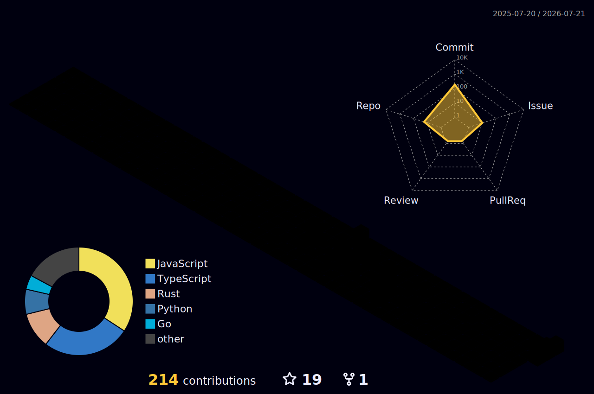

<div align="center">


[](https://git.io/typing-svg)

<p>
  <a href="https://github.com/Duang777?tab=repositories">
    
  </a>
  <a href="https://github.com/Duang777">
    
  </a>
  
</p>

</div>

```txt
duang777@github
------------------------------
Role:        AI-native builder
Now:         Agentic workflows, data governance, browser tooling
Stack:       Go / TypeScript / Python / Rust / React
Bias:        Ship small systems that reveal leverage
Location:    Beijing
```

## Signal

I build tools where language models meet real software surfaces: agent runtimes, browser extensions, data governance workflows, research automation, and product-grade prototypes. The fun part is turning an idea from "interesting demo" into a system with edges, memory, feedback, and a path to use.

<table>
  <tr>
    <td width="50%">
      <a href="https://github.com/Duang777/helios">
        
      </a>
    </td>
    <td width="50%">
      <a href="https://github.com/Duang777/GPT-Voyager">
        
      </a>
    </td>
  </tr>
  <tr>
    <td width="50%">
      <a href="https://github.com/Duang777/feedpilot">
        
      </a>
    </td>
    <td width="50%">
      <a href="https://github.com/Duang777/forgepilot-agent">
        
      </a>
    </td>
  </tr>
</table>

## Toolchain

<p align="center">
  
</p>

## Telemetry

<div align="center">


</div>

## Ops Board

<!-- The generated assets below appear after the workflows run in the profile repository. -->

<div align="center">

<picture>
  <source media="(prefers-color-scheme: dark)" srcset="dist/github-snake-dark.svg">
  <source media="(prefers-color-scheme: light)" srcset="dist/github-snake.svg">
  
</picture>

<br>



<br>


</div>

## Coordinates

<p align="center">
  <a href="https://github.com/Duang777/helios">Helios</a>
  ·
  <a href="https://duang777.github.io/helios/">Helios demo</a>
  ·
  <a href="https://github.com/Duang777/GPT-Voyager">GPT-Voyager</a>
  ·
  <a href="https://duang777.github.io/GPT-Voyager/">Voyager page</a>
  ·
  <a href="https://github.com/Duang777?tab=repositories">All repos</a>
</p>

<div align="center">


</div>
