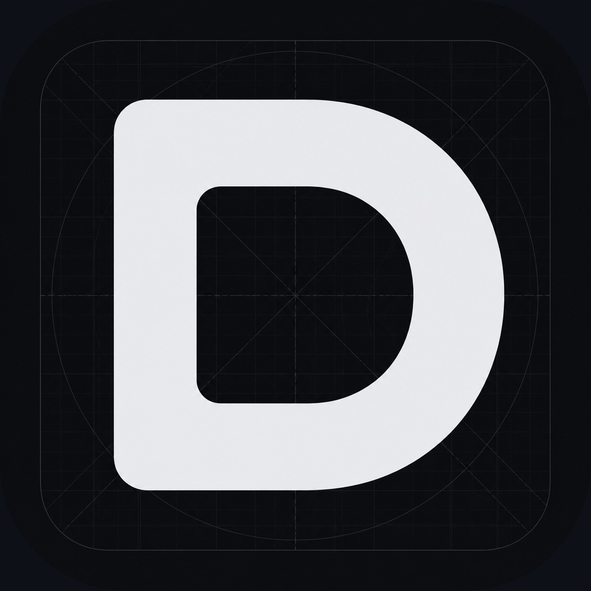

<div align="center">
  

  <h1><code>Duang777</code></h1>
  <p><code>agents</code> · <code>systems</code> · <code>developer-tools</code></p>
</div>

```txt
$ whoami
AI-native builder — agents, infra, and sharp developer tools.

$ focus
Turn messy workflows into systems with edges, memory, and feedback.
```

<div align="center">

### Selected Work

<table>
  <tr>
    <td width="50%" align="center">
      <a href="https://github.com/Duang777/helios">
        
      </a>
    </td>
    <td width="50%" align="center">
      <a href="https://github.com/Duang777/GPT-Voyager">
        
      </a>
    </td>
  </tr>
  <tr>
    <td width="50%" align="center">
      <a href="https://github.com/Duang777/feedpilot">
        
      </a>
    </td>
    <td width="50%" align="center">
      <a href="https://github.com/Duang777/forgepilot-agent">
        
      </a>
    </td>
  </tr>
</table>

<p>
  <a href="https://duang777.github.io/helios/">Helios</a>
  ·
  <a href="https://duang777.github.io/GPT-Voyager/">GPT-Voyager</a>
  ·
  <a href="https://github.com/Duang777?tab=repositories">All repos</a>
</p>

### Stack


### Activity


<br><br>


</div>
